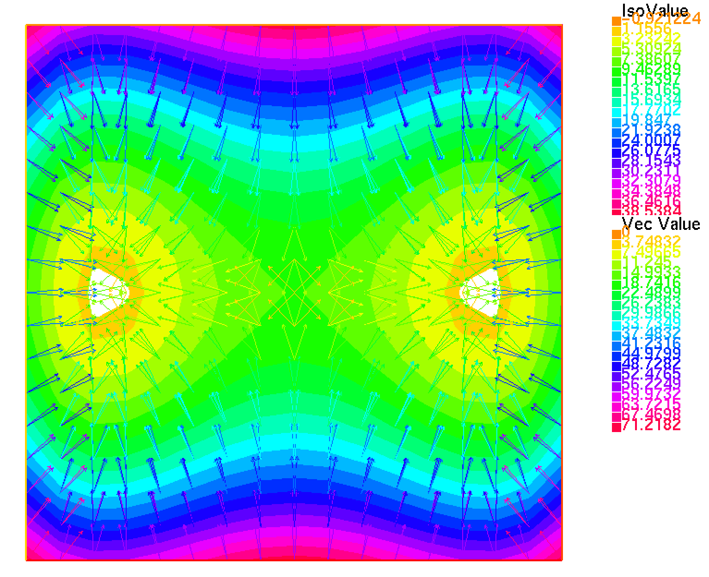
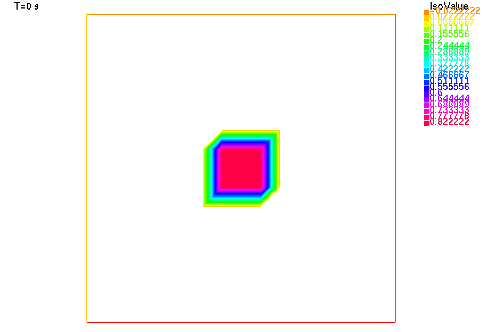

# Crowd-Motion simulation (ALG2-JKO with FreeFEM++)

### Introduction

For this school project I chose to model a crowd movement.To make the link with my courses, I chose a model based on PDEs. These models are quickly very complicated because of congestion constraints.

### Reference

The project therefore involved understanding the article [*An Augmented Lagrangian Approach to WasserStein Gradient Flows and Applications*](https://www.esaim-proc.org/articles/proc/pdf/2016/02/proc165401.pdf), written by J-D. BENAMOU, G. CARLIER and M. LABORDE.

### Project presentation

The crowd motion is modelized as an **advection-diffusion** equation with supplementary terms for congestion constraint handling.
I have implemented the Augmented Lagrangian Formulation proposed by the authors for solving the JKO scheme of time discretization (ALG2-JKO).

[In the report](Crowd_Motion_Projet_Jean-POUSSET.pdf) (in French only, sorry), I present this algorithm as well as additional explanations for the intermediate steps.

### Implementation

The ALG2 is basically an ADMM algorithm on a functionnal space. To approximate the functional variables and solve a 3D elliptic problem at each stage, I used the Finite Element Modelization [FreeFEM++ library](https://doc.freefem.org/introduction/index.html)(Hecht, F. (2012). New development in FreeFem++. Journal of numerical mathematics, 20(3-4), 251-266.
).

This was the first time I'd used a Finite Element Modelization (FEM) library. My code may therefore contain mathematical modeling or implementation errors.

### Results

I've managed to model a simple crowd movement. You can read the report for more details on the complexity of the model.

By imposing on the crowd the will to move given by the vector field V:

We obtain the following movement:

